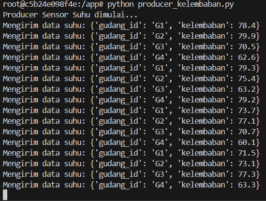
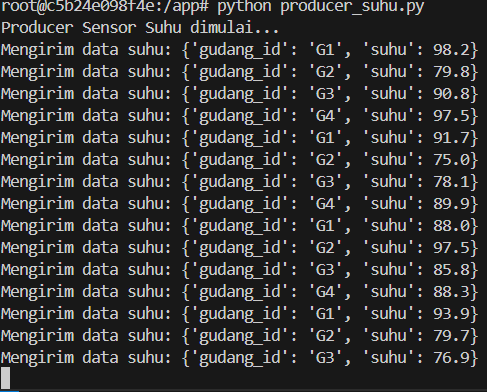
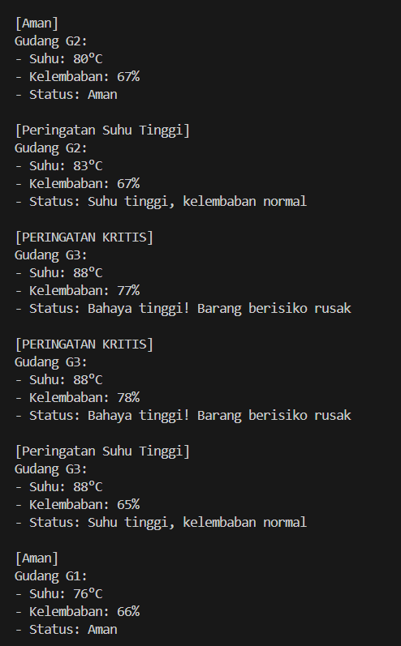

# Problem Based Learning : Apache Kafka

## 1. Buat Topik Kafka
Buat dua topik di Apache Kafka:

- sensor-suhu-gudang

- sensor-kelembaban-gudang

Topik ini akan digunakan untuk menerima data dari masing-masing sensor secara real-time.

1. Setup/Install Kafka Zookeeper (menggunakan docker)
```
docker-compose up -d
```


2. Lalu masuk ke kafka dan create topic
```
docker exec -it kafka bash
```
```
kafka-topics --create --topic sensor-suhu-gudang --bootstrap-server localhost:9092 --partitions 1 --replication-factor 1
kafka-topics --create --topic sensor-kelembaban-gudang --bootstrap-server localhost:9092 --partitions 1 --replication-factor 1
```


## 2. Simulasikan Data Sensor (Producer Kafka)
Buat dua Kafka producer terpisah:

a. Producer Suhu
Kirim data setiap detik

Format:

{"gudang_id": "G1", "suhu": 82}
b. Producer Kelembaban
Kirim data setiap detik

Format:

{"gudang_id": "G1", "kelembaban": 75}
Gunakan minimal 3 gudang: G1, G2, G3.

1. exec docker producer
```
docker exec -it producer bash```
```
dan kemudian jalankan
```
python producer_kelembaban.py
```



2. exec docker producer
```
docker exec -it producer bash```
```
dan kemudian jalankan
```
python producer_suhu.py
```


## 3. Konsumsi dan Olah Data dengan PySpark
a. Buat PySpark Consumer
Konsumsi data dari kedua topik Kafka.

b. Lakukan Filtering:
- Suhu > 80°C → tampilkan sebagai peringatan suhu tinggi

- Kelembaban > 70% → tampilkan sebagai peringatan kelembaban tinggi

Contoh Output:

- [Peringatan Suhu Tinggi]
Gudang G2: Suhu 85°C

- [Peringatan Kelembaban Tinggi]
Gudang G3: Kelembaban 74%

## 4. Gabungkan Stream dari Dua Sensor
Lakukan join antar dua stream berdasarkan gudang_id dan window waktu (misalnya 10 detik) untuk mendeteksi kondisi bahaya ganda.

c. Buat Peringatan Gabungan:
Jika ditemukan suhu > 80°C dan kelembaban > 70% pada gudang yang sama, tampilkan peringatan kritis.

✅ Contoh Output Gabungan:
[PERINGATAN KRITIS]
Gudang G1:
- Suhu: 84°C
- Kelembaban: 73%
- Status: Bahaya tinggi! Barang berisiko rusak

Gudang G2:
- Suhu: 78°C
- Kelembaban: 68%
- Status: Aman

Gudang G3:
- Suhu: 85°C
- Kelembaban: 65%
- Status: Suhu tinggi, kelembaban normal

Gudang G4:
- Suhu: 79°C
- Kelembaban: 75%
- Status: Kelembaban tinggi, suhu aman

1. exec docker spark
```
docker exec -it spark bash
```
kemudian jalankan
script spark_consumer.py
```
spark-submit --packages org.apache.spark:spark-sql-kafka-0-10_2.12:3.5.0 pyspark_consumer.py
```

